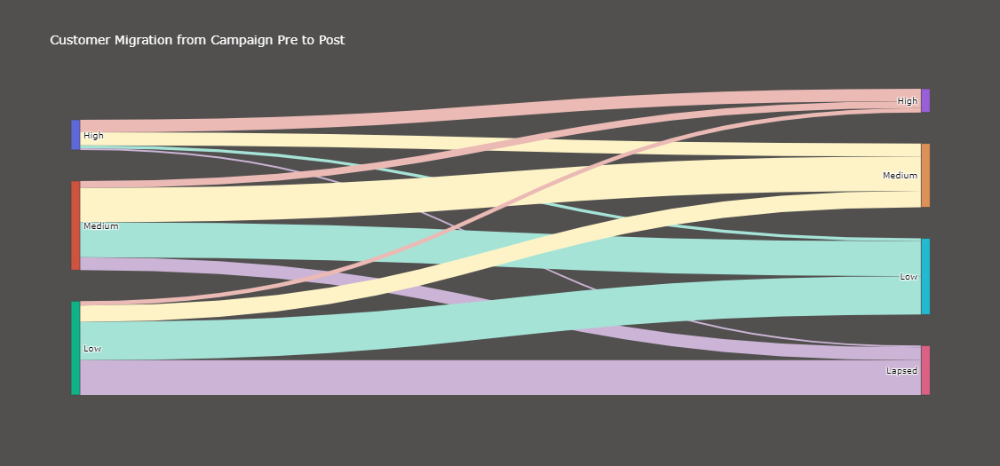
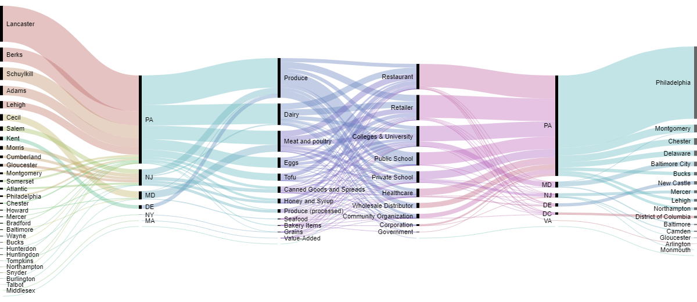

# Sankey_Diagram

Sankey diagrams are a type of flow diagram in which the width of the arrows is proportional to the flow rate. The illustration shows a Sankey diagram that represents all the primary energy that flows into a factory. 

This above shown chart is movable we can move those High, Medium, & Low.

